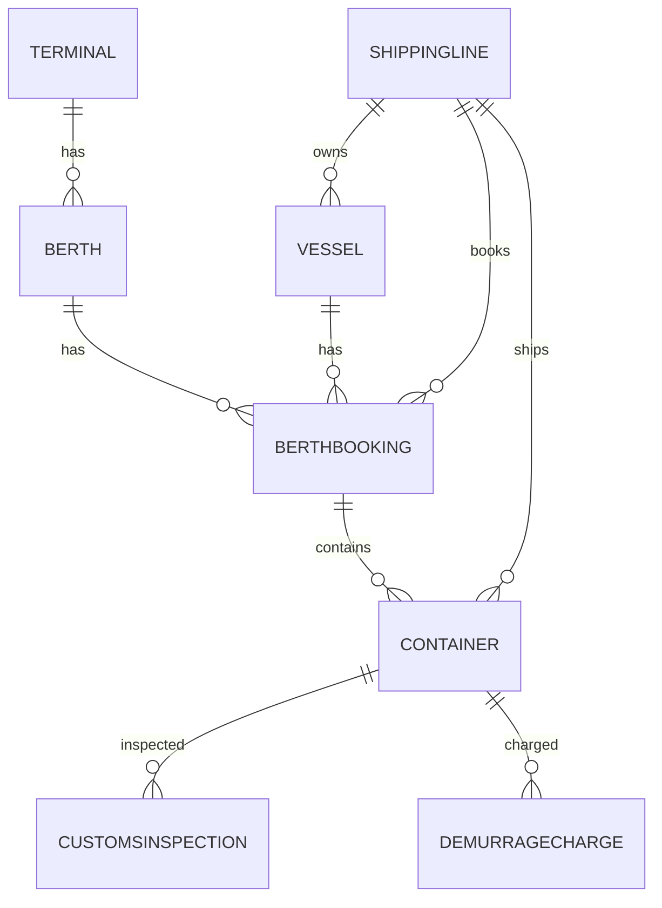

# Data Model

```mermaid
erDiagram
    TERMINAL ||--o{ BERTH : has
    BERTH ||--o{ BERTHBOOKING : has
    VESSEL ||--o{ BERTHBOOKING : has
    SHIPPINGLINE ||--o{ VESSEL : owns
    SHIPPINGLINE ||--o{ BERTHBOOKING : books
    BERTHBOOKING ||--o{ CONTAINER : contains
    SHIPPINGLINE ||--o{ CONTAINER : ships
    CONTAINER ||--o{ CUSTOMSINSPECTION : inspected
    CONTAINER ||--o{ DEMURRAGECHARGE : charged
```
